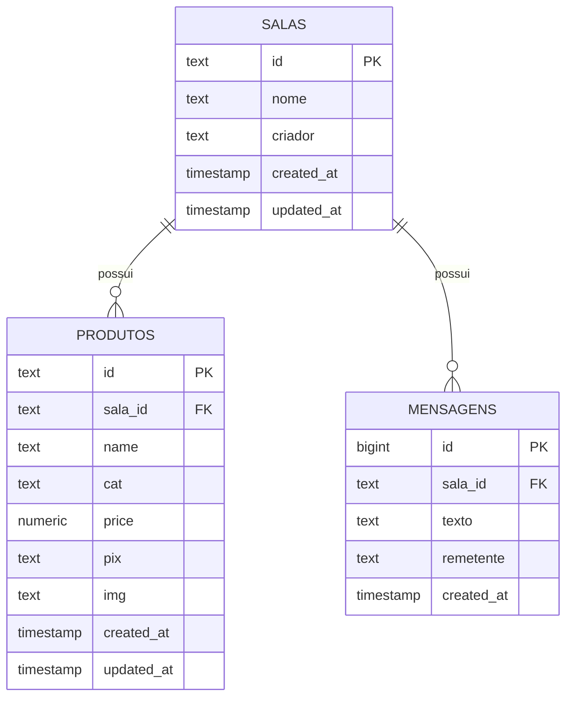

# 📦 GestãoPIX com Supabase

Sistema de vendas PIX com catálogo de produtos, salas e chat em tempo real.

## 🚀 Como criar e configurar o Supabase

### 1. Criar conta no Supabase

1. Acesse [https://supabase.com](https://supabase.com)
2. Clique em **"Start your project"** ou **"Sign up"**
3. Faça login com GitHub (recomendado) ou email
4. Confirme seu email (se necessário)

### 2. Criar um novo projeto

1. No dashboard, clique em **"New project"**
2. Preencha:
   - **Name**: `gestaopix` (ou o nome que preferir)
   - **Database Password**: Crie uma senha forte e **guarde** (ex: `Gestaopix@2024`)
   - **Region**: Escolha a mais próxima de você (ex: `São Paulo (sa-east-1)`)
3. Clique em **"Create new project"**
4. Aguarde ~2 minutos enquanto o banco é criado

### 3. Obter as credenciais

1. No dashboard do projeto, vá em **Settings → API** (menu lateral)
2. Copie:
   - **URL**: `https://xxxxxxxxxxxx.supabase.co`
   - **anon public**: `eyJhbGciOiJIUzI1NiIs...` (chave pública)
   - **service_role key**: (use apenas para testes, NUNCA no frontend)

### 4. Executar o SQL para criar as tabelas

1. No menu lateral, clique em **"SQL Editor"**
2. Clique em **"New query"**
3. Cole o SQL abaixo e clique em **"Run"**

```sql
-- ============================================
-- GESTÃO PIX - TABELAS SUPABASE
-- ============================================

-- 1. TABELA DE SALAS
CREATE TABLE IF NOT EXISTS public.salas (
    id TEXT PRIMARY KEY,
    nome TEXT NOT NULL,
    criador TEXT DEFAULT 'admin',
    created_at TIMESTAMPTZ DEFAULT NOW(),
    updated_at TIMESTAMPTZ DEFAULT NOW()
);

-- 2. TABELA DE PRODUTOS
CREATE TABLE IF NOT EXISTS public.produtos (
    id TEXT PRIMARY KEY,
    sala_id TEXT REFERENCES public.salas(id) ON DELETE CASCADE,
    name TEXT NOT NULL,
    cat TEXT DEFAULT 'Geral',
    price NUMERIC DEFAULT 0,
    pix TEXT,
    img TEXT,
    created_at TIMESTAMPTZ DEFAULT NOW(),
    updated_at TIMESTAMPTZ DEFAULT NOW()
);

-- 3. TABELA DE MENSAGENS (CHAT)
CREATE TABLE IF NOT EXISTS public.mensagens (
    id BIGSERIAL PRIMARY KEY,
    sala_id TEXT REFERENCES public.salas(id) ON DELETE CASCADE,
    texto TEXT NOT NULL,
    remetente TEXT DEFAULT 'cliente',
    created_at TIMESTAMPTZ DEFAULT NOW()
);

-- ============================================
-- ÍNDICES PARA PERFORMANCE
-- ============================================
CREATE INDEX IF NOT EXISTS idx_produtos_sala ON public.produtos(sala_id);
CREATE INDEX IF NOT EXISTS idx_produtos_cat ON public.produtos(cat);
CREATE INDEX IF NOT EXISTS idx_mensagens_sala ON public.mensagens(sala_id);
CREATE INDEX IF NOT EXISTS idx_mensagens_created ON public.mensagens(created_at DESC);

-- ============================================
-- RLS (ROW LEVEL SECURITY) - SEGURANÇA
-- ============================================
ALTER TABLE public.salas ENABLE ROW LEVEL SECURITY;
ALTER TABLE public.produtos ENABLE ROW LEVEL SECURITY;
ALTER TABLE public.mensagens ENABLE ROW LEVEL SECURITY;

-- Políticas de acesso público (para testes)
CREATE POLICY "Acesso público às salas" ON public.salas FOR ALL USING (true) WITH CHECK (true);
CREATE POLICY "Acesso público aos produtos" ON public.produtos FOR ALL USING (true) WITH CHECK (true);
CREATE POLICY "Acesso público às mensagens" ON public.mensagens FOR ALL USING (true) WITH CHECK (true);

-- ============================================
-- TRIGGER PARA ATUALIZAR updated_at
-- ============================================
CREATE OR REPLACE FUNCTION update_updated_at_column()
RETURNS TRIGGER AS $$
BEGIN
    NEW.updated_at = NOW();
    RETURN NEW;
END;
$$ language 'plpgsql';

CREATE TRIGGER update_salas_updated_at BEFORE UPDATE ON public.salas FOR EACH ROW EXECUTE FUNCTION update_updated_at_column();
CREATE TRIGGER update_produtos_updated_at BEFORE UPDATE ON public.produtos FOR EACH ROW EXECUTE FUNCTION update_updated_at_column();

-- ============================================
-- DADOS DE EXEMPLO
-- ============================================
INSERT INTO public.salas (id, nome, criador) 
VALUES ('loja1', 'Loja Exemplo', 'admin') 
ON CONFLICT (id) DO NOTHING;

INSERT INTO public.produtos (id, sala_id, name, cat, price, pix)
VALUES (
    'prod1', 
    'loja1', 
    'Produto Exemplo', 
    'Categoria', 
    10.00, 
    'chave-pix-exemplo@email.com'
) ON CONFLICT (id) DO NOTHING;
```

### 5. Habilitar Realtime (para chat e sincronização automática)

**IMPORTANTE!** Sem isso, o chat e as atualizações não funcionam em tempo real.

1. No menu lateral, clique em **"Database" → "Replication"**
2. Clique em **"Add Replication"**
3. Selecione as tabelas:
   - ✅ `produtos`
   - ✅ `mensagens`
4. Marque **"All events"** (INSERT, UPDATE, DELETE)
5. Clique em **"Save"**

### 6. Configurar no GestãoPIX

1. Abra o GestãoPIX no navegador
2. Clique no menu **"☁️ Supabase"**
3. Preencha:
   - **URL**: Cole a URL do seu projeto (ex: `https://xxxxxxxxxxxx.supabase.co`)
   - **Chave anon**: Cole a chave pública (anon key)
4. Clique em **"💾 Salvar e Conectar"**

## 🔧 Como usar

### Criar uma sala (lojista)

1. No menu, clique em **"📡 Criar Sala"**
2. Digite um nome (ex: `loja1`)
3. Clique em **"OK"**
4. A sala será criada no Supabase

### Entrar em uma sala (cliente)

**Opção 1 - Via URL:**
```
https://seu-site.com/gestaopix.html?sala=loja1
```

**Opção 2 - Via interface:**
1. Clique em **"🌐 Entrar na Sala"**
2. Digite o ID da sala
3. Clique em **"Conectar"**

### Adicionar produtos

1. Clique em **"➕ Novo Item"**
2. Preencha:
   - **Nome**: Nome do produto
   - **Categoria**: Ex: Eletrônicos, Roupas, etc.
   - **Preço**: Valor em R$
   - **Chave PIX**: Sua chave PIX (email, telefone, CPF, etc.)
   - **Imagem**: Foto do produto (opcional)
3. Clique em **"Salvar"**

### Vender

1. Cliente clica em **"🛒 Comprar"** no produto
2. Copia a chave PIX exibida
3. Paga via PIX diretamente para sua conta
4. **Você recebe 100% do valor, sem taxas!**

### Chat com cliente

1. Clique no menu **"💬 Chat"**
2. Digite uma mensagem
3. O cliente e o lojista veem as mensagens em tempo real

## 🎯 Estrutura do Banco de Dados



## ⚙️ Requisitos

- Navegador moderno (Chrome, Firefox, Edge, Safari)
- Conexão com internet
- Conta Supabase gratuita

## 💰 Preços do Supabase

| Plano | Preço | Limites |
|-------|-------|---------|
| **Free** | R$ 0 | 500 MB banco, 2 GB transferência/mês |
| **Pro** | US$ 25/mês | 8 GB banco, 50 GB transferência/mês |
| **Team** | US$ 599/mês | 30 GB banco, 200 GB transferência/mês |

**O plano Free é suficiente para começar!**

## 🧪 Testar se o Supabase está funcionando

### 1. Verificar conexão
```
http://localhost:3000/status
```

### 2. Testar no console do navegador (F12)
```javascript
// Verificar sala atual
console.log(salaAtual);

// Verificar dados
console.log(db);

// Forçar sincronização
forcarSincronizacao();
```

## 🐛 Problemas comuns

### Erro: "Could not find the table 'public.produtos'"
**Solução:** Execute o SQL novamente ou verifique se a tabela foi criada.

### Erro: "RLS policy violation"
**Solução:** Execute as políticas RLS do SQL novamente.

### Realtime não funciona
**Solução:** Habilite Replication nas tabelas `produtos` e `mensagens`.

### Chat não funciona
**Solução:** Verifique se a tabela `mensagens` foi criada e se o Realtime está habilitado.

## 📚 Recursos

- [Documentação Supabase](https://supabase.com/docs)
- [Guia Realtime](https://supabase.com/docs/guides/realtime)
- [GitHub do Projeto](https://github.com/Mimimifu/gestaopix)

## ❤️ Apoie o Projeto

- [Patreon](https://www.patreon.com/c/WorldsEcology/membership)
- [Ko-fi](https://ko-fi.com/lbzcds)
- PIX: `2c04642f-fbb7-40b0-9efb-434184b133f4`

---

**GestãoPIX - Venda sem taxas, com transparência e liberdade!** 🚀
